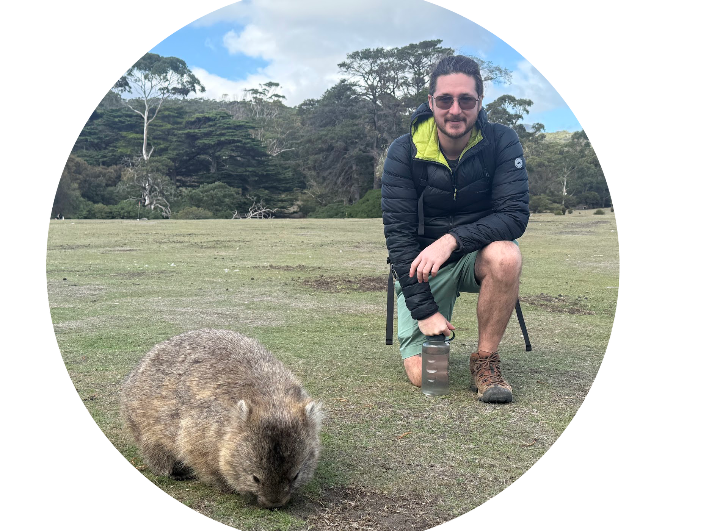

Hi! I'm Jasper, a robotics software engineer & researcher specialising in navigation, perception, manipulation and system design. I have a passion for building elegant, robust and intelligent systems that effectively handle real-world edge cases and perform well in natural and human environments. I believe a systems-level approach is essential to bringing together electrical, mechanical and software components. Alongside a deep understanding of the use case and environment, to build solutions that deliver real commercial value beyond one-off demos. 

I'm currently based in Mountain View, CA with <strong>Workr Labs</strong> as a Machine Learning Engineer and Robot Wrangler. We're building flexible, intelligent autonomy for high-mix manufacturing using systems that learn and improve. By leveraging synthetic data, real-time edge learning, and 3D reasoning, we enable robots to rapidly understand and work with novel objects for bin picking, pick-and-place, and machining tasks. I enjoy the fast paced and dynamic startup environment and where we are building a robotics product from the ground up. Manufacturing automation is changing fast and I love the challenges that come with that.

From 2022 to 2025, I worked at <strong>Emesent</strong> as part of the robotic autonomy team, developing navigation, perception, and behaviour algorithms for fully autonomous GPS-denied drone operations, as well as legged ground vehicle prototypes.

In 2021, I completed my PhD at the Australian Centre for Field Robotics at The University of Sydney. My research focused on the role of robotics in agriculture, with technical contributions to estimation, physical interaction, and grasping in agricultural robotics.

  

 
  <a href="https://www.linkedin.com/in/jasperebrown/">LinkedIn</a> |
  <a href="mailto:jasperebrown@gmail.com">Email</a> |
  <a href="https://scholar.google.com.au/citations?user=Wf5fKu0AAAAJ&hl=en">Google Scholar</a>

# Workr Labs
[Workr Labs](https://www.workr-labs.com/) is a startup trying to push the start of the art in flexible high mix manufacturing automation. As a small startup I've got a big pile of hats and I've enjoyed the opportunity to jump into everything from camera calibration to safety chain design. I've helped set up the CI/CD pipeline, developed and tuned the vision based perception system, performed camera assessments, built out the core grasping logic and spearheaded the isaac sim synthetic data generation experiments. 

# Emesent Robotics
[Emesent](https://www.emesent.com/) is a CSIRO originated scale up developing drone autonomy for 3D mapping of GPS denied environments. They do extensive work in mining safety, asset inspection, surveying and general purpose robotics capabilities. 

The emesent stack is built on the world leading Wildcat SLAM algorithm. My day to day work at Emesent was in ROS with C++ and python for developing modern 3D perception, navigation and planning modules for mobile ground robots and drones. I worked on supporting several platforms and Lidar types, with significant in house expertise in accelerated computing and real time operation.

  

Previously, I worked on the Meat & Livestock Australia Donor Company project: Objective, robust, real-time animal welfare measures for the Australian red meat industry (P.PSH.0819). We worked to apply cutting edge robotics and machine vision tools to improve both animal welfare and farm productivity together and support Australian farmers. The automated aerial animal detection paper came from this work, and investigations are continuing into this area. 

# My Publications
 
 **Design and Evaluation of a Modular Robotic Plum Harvesting System Utilising Soft Components**  
*Brown, J, Sukkarieh, S, “Design and evaluation of a modular robotic plum harvesting system utilising soft components,” Journal of Field Robotics. 2021; 38: 289– 306. [https://doi.org/10.1002/rob.21987](https://doi.org/10.1002/rob.21987)*  
[data](http://data.acfr.usyd.edu.au/Agriculture/PlumHarvesting/) | [paper](https://arxiv.org/abs/2007.06315)

   

 **Dataset and Performance Comparison of Deep Learning Architectures for Plum Detection and Robotic Harvesting**  
*Brown, J, “Dataset and Performance Comparison of Deep Learning Architectures for Plum Detection and Robotic Harvesting,”arXiv:2105.03832 [cs], May. 2021.*  
[data](http://data.acfr.usyd.edu.au/Agriculture/PlumDetection/) | [paper](https://arxiv.org/abs/2105.03832)

   
   

 **Improved Noise Covariance Estimation in Visual Servoing Using an Autocovariance Least-Squares Approach**  
*Brown, J, Daobilige, S, Kong, H, Sukkarieh, S, Kerrigan, E, “Improved noise covariance estimation in visual servoing using an autocovariance least-squares approach,” Mechatronics, 2020. [https://doi.org/10.1016/j.mechatronics.2020.102381](https://doi.org/10.1016/j.mechatronics.2020.102381)*  
[code](https://github.com/jaspereb/ALS_MHE_Results) | [paywall paper](https://www.sciencedirect.com/science/article/abs/pii/S0957415820300611?via%3Dihub) | Please [email](mailto:jasperebrown@gmail.com) for a pdf copy

   
 
 **Improved Noise Covariance Estimation in Visual Servoing Using an Autocovariance Least-Squares Approach**  
*Brown, J, Daobilige, S, Kong, H, Sukkarieh, S, Kerrigan, E, “Improved noise covariance estimation in visual servoing using an autocovariance least-squares approach,” IFAC, 2020. [https://doi.org/10.1016/j.ifacol.2019.11.044](https://doi.org/10.1016/j.ifacol.2019.11.044)*  
[paper](https://doi.org/10.1016/j.ifacol.2019.11.044)

   

  **Improving Monocular Depth Prediction in Ambiguous Scenes Using a Single Range Measurement**  
*Brown, J, Sukkarieh, S, “Improving Monocular Depth Prediction in Ambiguous Scenes Using a Single Range Measurement,” in 6th IFAC Conference on Sensing, Control and Automation Technologies for Agriculture (AGRICONTROL), 2019. [https://doi.org/10.1016/j.ifacol.2019.12.565](https://doi.org/10.1016/j.ifacol.2019.12.565)*  
[code](https://github.com/jaspereb/TRC) | [paper](https://www-sciencedirect-com/science/article/pii/S240589631932484X)

   
 
  **Automated Aerial Animal Detection When Spatial Resolution Conditions Are Varied**  
*Brown, J, Qiao, Y, Clark, C, Lomax, S, Rafique, K, Sukkarieh, S, “Automated Aerial Animal Detection When Spatial Resolution Conditions Are Varied ,” *  
[paper](https://arxiv.org/abs/2110.01329))
 
  
___

 

# My Tutorials
Throughout my research and tutoring work I've needed to master a few tools, and have found existing guides for these to be lacking in one aspect or another. So I've created a few of my own tutorials for these topics:

* **Faster RCNN Tutorial** ([code](https://github.com/jaspereb/FasterRCNNTutorial), [video](https://www.youtube.com/watch?v=9KmwZhTLV_s&feature=youtu.be)) Covers the creation of a new dataset for Faster RCNN and training this object detector on your new data.
* **Retinanet Tutorial** ([code](https://github.com/jaspereb/Retinanet-Tutorial), [video](https://www.youtube.com/watch?v=mr8Y_Nuxciw)) Covers the creation of a new dataset for Keras-Retinanet and training this object detector on your new data.
* **UR5 With ROS Tutorial** ([code](https://github.com/jaspereb/UR5_With_ROS_Moveit_Tutorial), [video](https://www.youtube.com/watch?v=18SQssJ-l_Y&feature=youtu.be)) How to connect a UR5 arm to ROS and use it with Moveit!.
* **T265 Pose Tracking Data** ([code](https://github.com/jaspereb/TestingRealsenseT265)) Testing the pose tracking accuracy of the Realsense T265 SLAM camera.
* **Camera Proejction Tutorial** ([code](https://github.com/jaspereb/CameraProjectionCalibration)) A short tutorial on calibrating and validating 3D point projection using a 2D camera and the Matlab computer vision toolbox.

 
___

 

# My Thesis
My PhD thesis has focused on grasping and manipulation technologies for robotics in agriculture, in order to approach the problem of harvesting soft fruit, such as plums. As part of this I worked with a wide range of researchers, advisers, technical staff and friends at the ACFR to develop a prototype harvester and test this on a commercial plum crop. In my thesis I also examine object detector architectures, filter tuning using the autocovariance least-squares method, active perception for bearings-only fruit localisation, stochastic object reconstruction and monocular depth inference. 

In addition to the links for the above papers, the following was developed for the thesis:

* [Active Perception Code](https://github.com/jaspereb/AP_Experiments)
* [Simple Parallel Gripper Design](https://github.com/jaspereb/SimpleSliderHand)
* [Thesis PDF](thesis.pdf)

 
___

 

 

  

  
